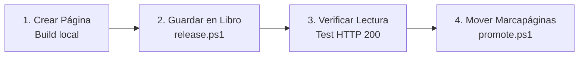

# El Flujo de Despliegue (Explicado con la Técnica Feynman)

Imagina un **libro** y un **marcapáginas**:

- Cada versión creada es una **página nueva e intocable** en el libro (`releases/0.5.14/`). Nunca se borran ni sobrescriben páginas viejas.
- Home Assistant solo mira un **marcapáginas** (`current.json`) que dice: *"Lee la página actual"*.

---

### Los 4 Pasos del Flujo

1. **Escribir (En tu PC)**: Modificamos el código y compilamos con Vite.
2. **Archivar (`release.ps1`)**: Se copia la carpeta a Home Assistant. *Nadie la ve todavía.*
3. **Comprobar**: Verificamos que Home Assistant responda con `HTTP 200`.
4. **Publicar (`promote.ps1`)**: Movemos el marcapáginas a la nueva página.

---

### ¿Por qué es seguro y no requiere reinicio?

- **Cero reinicios**: Home Assistant no se reinicia; al presionar **Ctrl + F5**, el navegador simplemente lee la página a la que apunta el marcapáginas.
- **Rollback instantáneo**: Si algo falla, movemos el marcapáginas a la versión anterior (`rollback.ps1 -Version 0.5.13`) y todo vuelve a la normalidad en un segundo.
