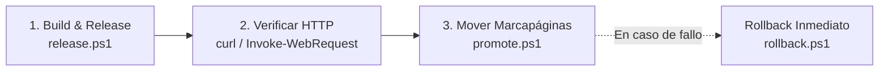

# Witmind UI — Guía Rápida de Comandos (`run.md`)

Guía consolidada con los comandos más frecuentes y típicos del repositorio, categorizados por flujo de trabajo diario: desarrollo, testing, telemetría, verificación E2E y despliegue hacia Home Assistant.

> [!TIP]
> **Runtime principal del proyecto:** Utilizamos **Bun** (`bun 1.3+`) como entorno de ejecución y gestor de dependencias estándar por su velocidad ultrarrápida. Los comandos también funcionan con `npm` si fuera necesario.

---

## ⚡ 1. Resumen Rápido (Cheat Sheet)

| Acción | Comando con Bun (Predeterminado) | Equivalente NPM | Descripción |
|---|---|---|---|
| **Instalar deps** | `bun install` | `npm install` | Instala dependencias del proyecto |
| **Iniciar dev** | `bun dev` | `npm run dev` | Servidor local Vite en `http://localhost:5173` |
| **Validar tipos** | `bun x tsc --noEmit` | `npx tsc --noEmit` | Chequeo estricto TypeScript sin generar archivos |
| **Tests unitarios** | `bun test` *(o `bun run test`)* | `npm test` | Ejecuta suite Vitest en modo CI (`run`) |
| **Tests interactivos** | `bun run test:watch` | `npm run test:watch` | Modo watch interactivo con Vitest |
| **Telemetría HA** | `bun run ha:sensors` | `npm run ha:sensors` | Imprime estado vivo, potencias y confort de HA |
| **Build app** | `bun run build` | `npm run build` | Compila TypeScript y empaqueta app general |
| **Build panel HA** | `bun run build:panel` | `npm run build:panel` | Genera `dist-panel/witmind-ui.html` para Home Assistant |
| **Debug panel** | `bun run debug:panel` | `npm run debug:panel` | Servidor local 5199 + inspección con Playwright |
| **Previsualizar** | `bun run preview` | `npm run preview` | Servidor local sirviendo `dist/` |
| **Release HA** | `powershell -File tools/release.ps1 -Version X.Y.Z` | — | Empaqueta y copia release inmutable |
| **Promote HA** | `powershell -File tools/promote.ps1 -Version X.Y.Z` | — | Cambia el puntero `current.json` a la nueva versión |
| **Rollback HA** | `powershell -File tools/rollback.ps1 -Version X.Y.W` | — | Revierte instantáneamente a versión previa |

---

## 🛠️ 2. Entorno y Desarrollo Local

### Instalación de dependencias
```bash
bun install
```
*(Alternativa: `npm install`)*

### Servidor de desarrollo (Vite)
```bash
bun dev
```
Inicia el servidor local por defecto en `http://localhost:5173/`. Permite Hot Module Replacement (HMR) instantáneo.

### Previsualización de la build
```bash
bun run preview
```
Sirve los archivos generados en `dist/`. Para forzar el puerto 5174 (usado por scripts de test automatizados):
```bash
bun run preview -- --port 5174
```

### Rutas locales clave en el navegador
- **Aplicación principal / Workspace:** `http://localhost:5173/`
- **Panel Showroom:** `http://localhost:5173/showroom-panel.html`
- **Showroom Witmind Signature:** `http://localhost:5173/showroom-witmind-signature.html`
- **Showroom Witmind Signature (Light):** `http://localhost:5173/showroom-witmind-signature-light.html`
- **Panel Embebido Witmind UI:** `http://localhost:5173/witmind-ui.html`

---

## 🏗️ 3. Compilación y Validación de Tipos (Builds)

### Validación estricta de TypeScript (sin emitir ficheros)
```bash
bun x tsc --noEmit
```
Recomendado antes de cualquier commit o release para validar que no haya regresiones de tipado en `src/` ni `tools/`.

### Build general de la aplicación
```bash
bun run build
```
Ejecuta `tsc && vite build` y genera el paquete de producción en la carpeta `dist/`.

### Build específico para panel Home Assistant
```bash
bun run build:panel
```
Compila en modo panel (`vite build --mode panel`), empaquetando todo de forma autocontenida en `dist-panel/witmind-ui.html` y sus assets versionados con hash en `dist-panel/assets/`.

---

## 🧪 4. Pruebas Unitarias y QA

### Ejecutar tests unitarios (Vitest)
```bash
bun test
# o explícitamente:
bun run test
```
Ejecuta las suites de `src/tests/unit/`:
- `building-config.test.ts` (Validación de entidades y circuitos del BMS)
- `energy-model.test.ts` (Modelado energético y potencias nominales)
- `formatting.test.ts` (Helpers de fechas, números y unidades)
- `notifications-model.test.ts` (Lógica de alertas y severidad)
- `swipe-gesture.test.ts` (Detección de umbrales y gestos táctiles)
- `wit-viz.test.ts` (Presets y visualizaciones ECharts)

### Modo interactivo continuo (Watch)
```bash
bun run test:watch
```

### Tests unitarios Python (Componentes Home Assistant / SQLite)
```bash
python -m unittest tests/test_witmind_calendar.py
```
Valida la integración con SQLite y el repositorio de calendario laboral de Home Assistant.

---

## 📡 5. Telemetría y Diagnóstico en Vivo (Home Assistant / BMS)

Herramientas CLI para auditar la telemetría viva de Home Assistant (`http://192.168.20.232:8123`) desde la consola:

### Reporte rápido de sensores y circuitos
```bash
bun run ha:sensors
```
o ejecutando directamente con el runtime:
```bash
node --experimental-strip-types tools/inspect-ha-sensors.mjs
```

### Opciones y filtros disponibles:
```bash
# Filtrar solo entidades de Planta Baja (Showroom, Lobby, Grabación)
node --experimental-strip-types tools/inspect-ha-sensors.mjs --floor ground

# Filtrar solo entidades de Planta Alta (Oficinas, Taller, Multiuso)
node --experimental-strip-types tools/inspect-ha-sensors.mjs --floor upper

# Salida estructurada en JSON (ideal para análisis o scripts)
node --experimental-strip-types tools/inspect-ha-sensors.mjs --json
```

### Debugging del panel BMS con Playwright / CDP
```bash
bun run debug:panel
```
Levanta un servidor interno en el puerto `5199` sobre `dist-panel` y audita con Playwright Chromium el renderizado real, la geometría del plano y los overlays.

### Auditoría visual de notificaciones
```bash
node tools/debug-notifications-appearance.mjs
```

---

## 🔬 6. Scripts de Verificación Automatizada (E2E & Layout & Gestos)

### Verificación de aliases de paneles (Bridge)
Comprueba que todos los custom elements y paneles coincidan exactamente con su identificador:
```bash
node tools/verify-panel-aliases.mjs
```
*(No requiere servidor previo levantado)*.

### Verificación del panel de notificaciones
Levanta Vite interno en puerto 5192 e inyecta estados mock:
```bash
node tools/verify-notifications-panel.mjs
```

### Verificaciones contra servidor local (Puerto 5174)
> **Requisito previo:** Iniciar el servidor preview en el puerto 5174 en una terminal independiente:
> ```bash
> bun run preview -- --port 5174
> ```

Luego, ejecuta en otra terminal según la suite a validar:

```bash
# Verificar arranque limpio del panel en viewport móvil (390x844)
node tools/verify-mobile-bootstrap.mjs

# Verificar swipe táctil horizontal entre tarjetas
node tools/verify-mobile-card-swipe.mjs

# Verificar estabilidad de swipe ante actualizaciones reactivas de estado
node tools/verify-mobile-rerender-swipe.mjs

# Verificar layout responsive de plantas (Desktop 1440, Tablet 1024, Mobile 390)
node tools/verify-building-floor-layout.mjs

# Verificar bounding boxes de overlays vivos en el edificio
node tools/verify-building-live-overlays.mjs

# Verificar layout móvil de Witmind Lobby
node tools/verify-lobby-mobile-layout.mjs

# Verificar idempotencia en la inicialización del bridge
node tools/verify-bridge-idempotency.mjs
```

> [!NOTE]
> Los scripts basados en Playwright se invocan con `node` debido a que el driver binario de Playwright en Windows requiere el proceso hijo de Node.

---

## 🚀 7. Flujo Seguro de Despliegue a Home Assistant

El despliegue sigue la política estricta de versionado inmutable explicada en [`docs/FLUJO_DESPLIEGUE_FEYNMAN.md`](file:///c:/dev/automatizacion-estilo/docs/FLUJO_DESPLIEGUE_FEYNMAN.md) y [`witmind-ha-release-guard`](file:///c:/dev/automatizacion-estilo/.agents/skills/witmind-ha-release-guard/SKILL.md).



### Paso 1: Generar y publicar la versión (Página nueva)
Compila con TypeScript + Vite mode panel, renombra `witmind-ui.html` a `index.html` y copia los archivos a Samba `\\192.168.20.232\config\www\witmind-ui\releases\<version>` y copia local en `home-assistant/`:

```powershell
powershell -ExecutionPolicy Bypass -File tools/release.ps1 -Version 0.5.15
```

> [!WARNING]
> Nunca sobreescribas una versión ya existente. Incrementa siempre el número semántico (`0.5.14` -> `0.5.15`).

### Paso 2: Verificar respuesta HTTP 200 (Antes de promover)
Comprueba que Home Assistant ya sirve el nuevo archivo:
```powershell
curl -I http://192.168.20.232:8123/local/witmind-ui/releases/0.5.15/index.html
```
*(O con PowerShell: `(Invoke-WebRequest -Uri "http://192.168.20.232:8123/local/witmind-ui/releases/0.5.15/index.html").StatusCode`)*

### Paso 3: Promover a versión estable (Mover el marcapáginas)
Actualiza atómicamente `current.json` en Home Assistant y localmente:
```powershell
powershell -ExecutionPolicy Bypass -File tools/promote.ps1 -Version 0.5.15
```
A partir de este momento, los clientes que abran Home Assistant o hagan **Ctrl + F5** cargarán la versión `0.5.15`. **No requiere reiniciar Home Assistant.**

### Paso 4 (Opcional): Rollback instantáneo
Si surge cualquier imprevisto en producción, revierte al instante el marcapáginas a la versión anterior estable:
```powershell
powershell -ExecutionPolicy Bypass -File tools/rollback.ps1 -Version 0.5.14
```

---

## 🗄️ 8. Base de Datos y Backend (SQLite)

### Migración y verificación del Calendario Laboral a SQLite 3
Lee los eventos desde `.storage/calendario_laboral` de Home Assistant e inserta/sincroniza en `witmind.db`:
```bash
python tools/migrate-calendar-sqlite.py
```
Opciones:
```bash
python tools/migrate-calendar-sqlite.py --dry-run
python tools/migrate-calendar-sqlite.py --storage-path "\\192.168.20.232\config\.storage\calendario_laboral" --db-path "\\192.168.20.232\config\witmind\witmind.db"
```

---

## 🌐 9. Comprobaciones de Red y Conectividad

### Verificar acceso a Home Assistant
```powershell
Test-NetConnection -ComputerName 192.168.20.232 -Port 8123
```

### Verificar acceso a la carpeta compartida Samba
```powershell
Test-Path "\\192.168.20.232\config\www\witmind-ui"
```

---

## 📚 Enlaces de Referencia en el Proyecto

- [package.json](file:///c:/dev/automatizacion-estilo/package.json)
- [docs/README.md](file:///c:/dev/automatizacion-estilo/docs/README.md)
- [docs/FLUJO_DESPLIEGUE_FEYNMAN.md](file:///c:/dev/automatizacion-estilo/docs/FLUJO_DESPLIEGUE_FEYNMAN.md)
- [docs/PLAN_MAESTRO_CONTROL_EDIFICIO_BMS.md](file:///c:/dev/automatizacion-estilo/docs/PLAN_MAESTRO_CONTROL_EDIFICIO_BMS.md)
- [docs/WITMIND_VISUAL_CONTRACT.md](file:///c:/dev/automatizacion-estilo/docs/WITMIND_VISUAL_CONTRACT.md)
- [.agents/skills/witmind-ha-release-guard/SKILL.md](file:///c:/dev/automatizacion-estilo/.agents/skills/witmind-ha-release-guard/SKILL.md)
- [.agents/skills/witmind-failure-history/SKILL.md](file:///c:/dev/automatizacion-estilo/.agents/skills/witmind-failure-history/SKILL.md)
